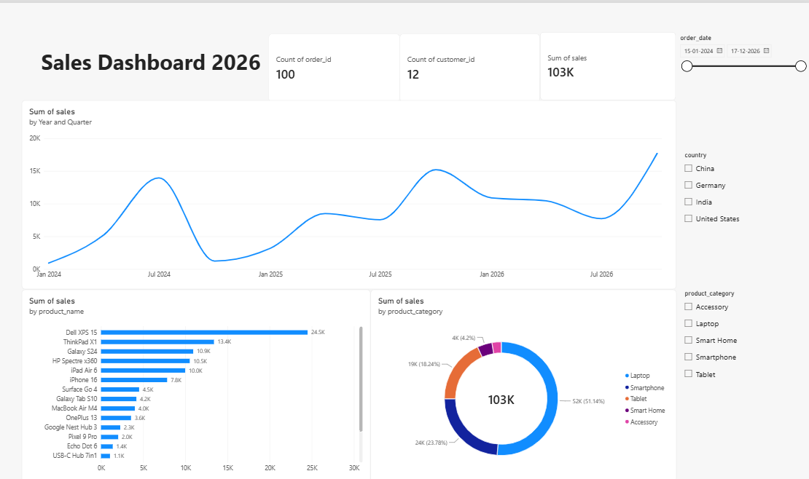

# My First Power BI Dashboard 📊

> My first-ever hands-on Power BI project — learning, building,
> experimenting, and documenting the journey.

## 🌱 Why This Project Matters to Me

What makes this project special to me isn't that the dashboard is
perfect — it is that it represents the first time I went from
learning a new tool to actually creating a report with it.

I started with a YouTube tutorial, learned by following along,
experimented with the different Power BI features, and eventually
created my first complete report.

This project is a starting point for my Power BI learning journey.

I also want to use GitHub to document the learning process itself,
rather than only uploading finished projects.

I believe learning progress can also be documented.

## 📌 About This Project

This is my first-ever project using Microsoft Power BI.

I started learning Power BI through a YouTube tutorial and decided
not to stop at simply following along with the lessons. I wanted to
build my first complete report and document the process of learning
along the way.

This repository represents my starting point with Power BI — from
exploring the tool for the first time to creating my first report.

## 📊 Dashboard Preview



## 📈 Dashboard Overview

This dashboard provides a visual overview of sales performance across
different time periods, products, product categories, and countries.

The report includes:

- Total number of orders
- Total number of customers
- Total sales
- Sales trends over time
- Sales by product
- Sales by product category
- Country-level filtering
- Product-category filtering
- Date-range filtering

## 🔍 What the Dashboard Shows

The report uses several visualizations to explore sales performance.

### Sales Trend

A line chart shows how sales change over time, making it easier to
identify periods of higher and lower sales.

### Sales by Product

A horizontal bar chart compares sales across individual products
and highlights the highest-performing products.

### Sales by Product Category

A donut chart provides a breakdown of total sales across product
categories.

### Interactive Filters

The report includes filters for:

- Date
- Country
- Product category

These allow the report to be explored from different perspectives.

## 🎯 Why I Built This

I wanted to get hands-on experience with Power BI rather than only
learning the concepts theoretically.

More importantly, I wanted to start documenting my learning process.

I believe learning progress can also be documented — not just the
finished result.

This project is therefore both a Power BI report and a record of my
first steps into Power BI.

## 🧠 What I Learned

This project gave me my first practical experience with Power BI.

Some of the things I learned while building this report include:

- Navigating Power BI Desktop
- Importing and exploring data
- Working with Power Query
- Understanding tables and relationships
- Creating visualizations from data
- Creating KPI cards
- Using slicers and filters
- Creating and using DAX measures
- Building a basic analytical dashboard
- Thinking about how to present data visually

## 🛠️ Tools Used

- Microsoft Power BI Desktop
- Power Query
- DAX
- Git
- GitHub

## 📚 Learning Journey

This section documents my progress while building my first Power BI
report.

### Getting Started

- Started learning Power BI
- Explored Power BI Desktop
- Followed a hands-on tutorial
- Imported and explored the dataset
- Began understanding the Power BI workflow

### Building the Report

- Worked with the dataset
- Explored data transformation
- Created visualizations
- Experimented with report design
- Worked with filters and interactions

### Data Modeling & Analysis

- Explored relationships between tables
- Started working with DAX
- Created measures
- Learned how Power BI uses the data model for analysis

### Completing My First Report

- Refined the report
- Improved the visual layout
- Adjusted visualizations and interactions
- Completed my first Power BI report

## 💡 Challenges & Lessons

As this was my first Power BI project, a major part of the experience
was getting comfortable with a completely new tool.

Instead of trying to make the first project perfect, I focused on
understanding the workflow and learning by building.

Some concepts became clearer only after working with the data and
actually creating the report.

## 📂 Repository Structure

```text
├── First Dashboard.Report/
├── First Dashboard.SemanticModel/
├── First Dashboard.pbip
├── .gitignore
└── README.md
```
